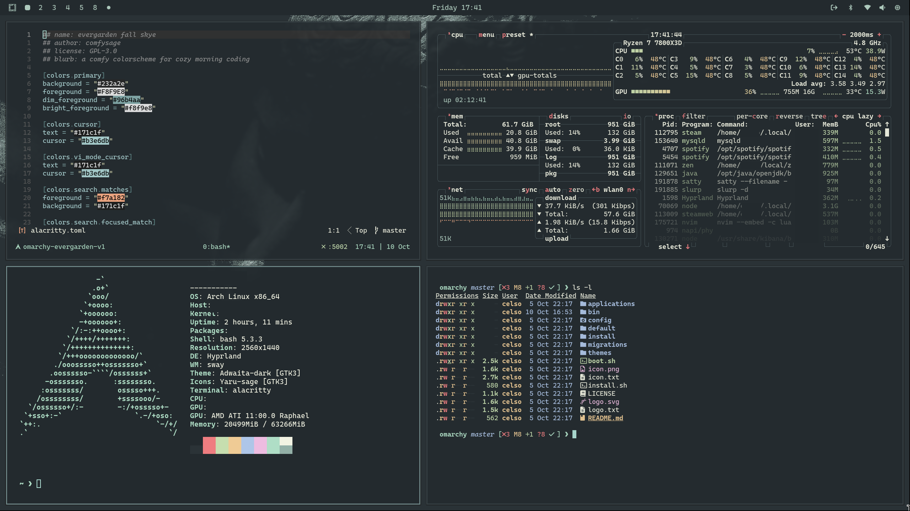

# omarchy-evergarden

[Omarchy](https://omarchy.org/) port of the [Evergarden](https://everviolet.xyz/) theme.



### Installation

```bash
git clone https://github.com/celsobenedetti/omarchy-evergarden.git ~/.config/omarchy/themes/evergarden

# or 
git clone https://github.com/celsobenedetti/omarchy-evergarden.git ~/local/omarchy-evergarden
ln -s ~/local/omarchy-evergarden/ ~/.config/omarchy/themes/evergarden
```
